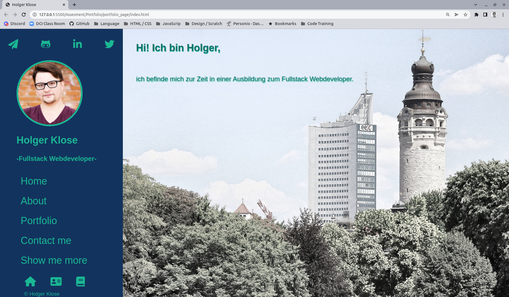

# my PortfolioPage

**[Test this app yourself](github.link)**

---

#### Navigation

- About Project
  - _Description_
  - _Developed With_
- How to use this Project
  - _Description_
  - _Developed With_
- Contact
  - _Mail_
  - _GitHub_
  - _LinkedIn_
- Used Tools
  - _Fonts_
  - _Design_
  - _Icons_
  - _Colors_

---

### About Project

This is my first page i designed for my own to show some of my skills

### How to use this Project

have a look and check my progress while learning HTML/CSS/JavaScript/React etc.

##### Developed With

- [x] _HTML5_
- [x] _CSS3_
- [x] _SASS_
- [x] _SCSS_
- [x] _JavaScript_
- [ ] _React_
- [ ] _Bootstrap_
- [x] _npm_
- [ ] _..._

---

### Contact

Mail: <holgeraliusklose@gmail.com> 
GitHub: [Holledrums](https://github.com/holledrums) 
LinkedIn: [Holger Klose](https://www.linkedin.com/in/holger-klose-240831147/)

---

### Used Tools

- [icons](https://)
- [Canva](https://www.canva.com/)
- [npm](https://www.npmjs.com/)
- [Google Fonts](https://fonts.google.com/)
- [Visual Studio Code](https://code.visualstudio.com/)
- [ColorZilla](https://www.colorzilla.com/chrome/)

---

Made with ❤️ by me
